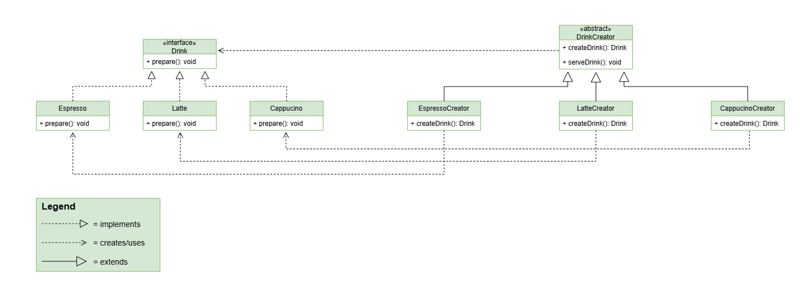
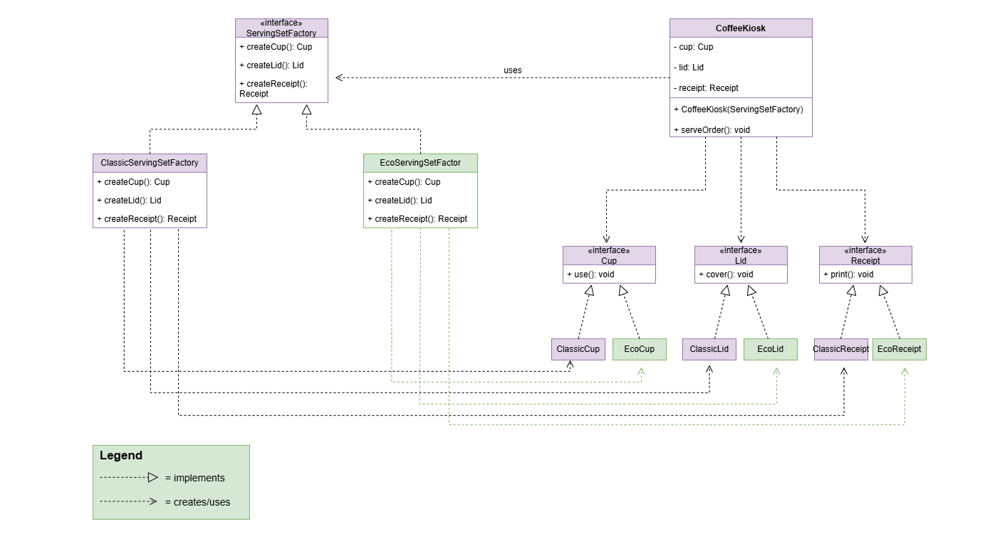

## Assignment 2
## Coffee Kiosk
This project demonstrates two creational design patterns:
Factory Method and Abstract Factory.
I have selected a Coffee Kiosk.

## Part A
The Factory Method pattern is used to create different types of drinks.

### Product
Drink - is the product interface. It contains the prepare() method.

### Concrete Products
The project has three drink implementations:
- Espresso
- Latte
- Cappuccino

Each drink has its own implementation of the prepare() method.

### Creator
DrinkCreator is an abstract creator.
It contains:
- createDrink() — the factory method
- serveDrink() — business logic that works with the Drink interface

### Concrete Creators
There are three concrete creators:
- EspressoCreator
- LatteCreator
- CappuccinoCreator

Each creator overrides createDrink() and creates the corresponding drink.
The client does not create Espresso, Latte, or Cappuccino directly.

## Part B
The Abstract Factory pattern is used to create a family of related products for serving an order.
The product family consists of:
- Cup
- Lid
- Receipt

There are two styles of serving sets: Classic and Eco.

### Classic Family
ClassicServingSetFactory creates:
- ClassicCup
- ClassicLid
- ClassicReceipt

### Eco Family
EcoServingSetFactory creates:
- EcoCup
- EcoLid
- EcoReceipt

### Abstract Factory
ServingSetFactory is the abstract factory interface.
It contains:
- createCup()
- createLid()
- createReceipt()

CoffeeKiosk receives a ServingSetFactory through its constructor and works only with the product interfaces.
Changing the factory changes the whole family of products.

## Factory Method vs Abstract Factory
Factory Method creates one type of product. In this project, it creates a Drink.
Factory Method mainly uses inheritance through different DrinkCreator subclasses.

Abstract Factory creates a family of related products.
In this project, it creates a matching Cup, Lid, and Receipt.
Abstract Factory uses composition because CoffeeKiosk receives a ServingSetFactory.

## Project Structure
src/
factorymethod/
- Drink
- Espresso
- Latte
- Cappuccino
- DrinkCreator
- EspressoCreator
- LatteCreator
- CappuccinoCreator
- Main

abstractfactory/
- Cup
- Lid
- Receipt
- ClassicCup
- ClassicLid
- ClassicReceipt
- EcoCup
- EcoLid
- EcoReceipt
- ServingSetFactory
- ClassicServingSetFactory
- EcoServingSetFactory
- CoffeeKiosk
- Main

## UML Diagrams
## Factory Method
The following UML diagram shows the structure of the Factory Method pattern
used in the Coffee Kiosk project.

## Abstract Factory
The following UML diagram shows the structure of the Abstract Factory pattern
and the two product families: Classic and Eco.
